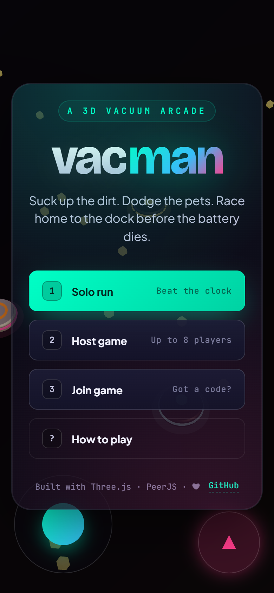
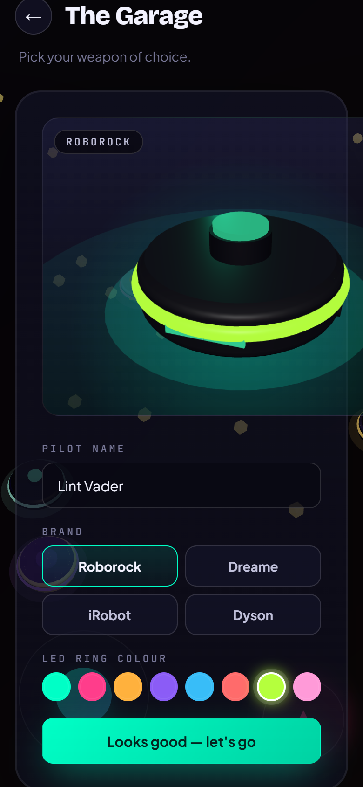
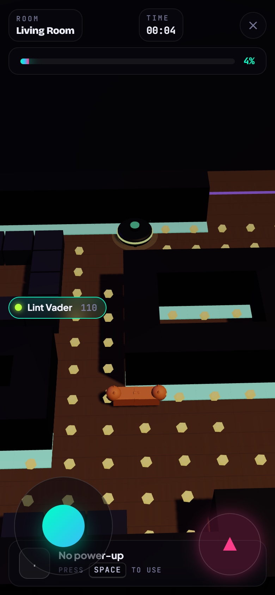

<h1 align="center">
  
</h1>

<p align="center">
  <em>A 3D vacuum-cleaner Pac-Man for the browser. Clean every room, dodge the pets, race your friends home to the dock.</em>
</p>

<p align="center">
  <a href="https://mayerwin.github.io/Vacman/"><b>▶ Play in your browser</b></a>
  &nbsp;·&nbsp;
  <a href="#how-to-play">How to play</a>
  &nbsp;·&nbsp;
  <a href="#multiplayer">Multiplayer</a>
  &nbsp;·&nbsp;
  <a href="#run-locally">Run locally</a>
</p>

<table align="center">
  <tr>
    <td></td>
    <td></td>
    <td></td>
  </tr>
  <tr>
    <td align="center"><sub>Title</sub></td>
    <td align="center"><sub>The Garage</sub></td>
    <td align="center"><sub>In-game (Living Room)</sub></td>
  </tr>
</table>

---

## What it is

Vacman is a free, no-install 3D arcade game in the spirit of Pac-Man, except instead of a yellow disc you control a round robot vacuum, the dots are dust bunnies, and the ghosts are housepets. Six hand-designed rooms make up a single house — a living room, a kitchen, a bedroom, a bathroom, a garage, and the final charging dock. To unlock each door you have to suck up every last speck of dirt.

Bring up to **eight pilots** along for the ride. Multiplayer runs over WebRTC peer-to-peer, so it works on a LAN or across the internet, with **no server to deploy** — share a 4-character code (or the invite link) and you're playing.

## Highlights

- 🌀 **Round-vacuum hero** in four bona-fide brand looks: Roborock (LiDAR tower), Dreame (orange ring), iRobot (side brushes), Dyson (cyclone fan)
- 🎨 **8-colour LED ring** so every pilot is instantly recognisable
- 🐱🐶🐹🦜 **Four pet types**, each with its own AI: cats hunt smartly, dogs charge in straight lines, hamsters roll randomly, parrots fly straight over walls
- ⚡ **Five power-ups**: Turbo, Auto-turret, Mine, Big bomb, Stealth
- 🏠 **Six rooms**: Living Room → Kitchen → Bedroom → Bathroom → Garage → Charging Dock
- 🤝 **Co-op**, ⚡ **Versus**, and 🏃 **Solo time-attack** modes
- 📱 **Touch joystick** on mobile, full keyboard on desktop
- 🌐 **No server required** — peer-to-peer multiplayer over WebRTC
- 🚀 **No build step** — pure HTML/CSS/ES modules + Three.js + PeerJS via CDN

## How to play

| | |
|---|---|
| Drive | <kbd>W</kbd> <kbd>A</kbd> <kbd>S</kbd> <kbd>D</kbd> &nbsp; or &nbsp; <kbd>↑</kbd> <kbd>←</kbd> <kbd>↓</kbd> <kbd>→</kbd> &nbsp; or &nbsp; the on-screen joystick |
| Use power-up | <kbd>Space</kbd> (or the action button on mobile) |
| Pause / quit | <kbd>Esc</kbd> |
| Title shortcuts | <kbd>1</kbd> Solo · <kbd>2</kbd> Host · <kbd>3</kbd> Join · <kbd>?</kbd> Help |

The job is simple: **vacuum every speck of dirt** to unlock the next door, then escape to the dock at the end of the house. Touching a pet stuns you for two seconds and costs you points.

### Power-ups

| Icon | Name | What it does |
|:---:|---|---|
| ⚡ | **Turbo** | 1.5× speed for 5 seconds |
| 🔫 | **Auto-turret** | Mounts a turret on top of your bot that auto-fires for 8 seconds |
| 💣 | **Mine** | Drops behind you. Detonates on the first pet to walk over it |
| 💥 | **Big bomb** | Drops behind you. Wide blast radius — careful where you stand |
| 🤫 | **Stealth** | Pets ignore you for 4 seconds |

### Modes

- **Solo run** — single player, beat the clock through all six rooms
- **Co-op** — up to 8 pilots on the same team, shared score, all rooms
- **Versus** — same room, every pilot for themselves, highest score wins

## Multiplayer

Vacman uses WebRTC (via [PeerJS](https://peerjs.com/)) for peer-to-peer networking. The host runs the simulation; guests stream their inputs back and render snapshots from the host. There is **no game server** — the only piece of shared infrastructure is the public PeerJS broker that does signalling.

To play with friends:

1. **One person hosts**: pick "Host game", then "Co-op" or "Versus". You'll get a 4-character room code (e.g. `K3M9`) and a copyable invite link.
2. **Everyone else joins**: open the invite link, or pick "Join game" on the title screen and type the code.
3. The host hits **Start game** when everyone's in.

Lobby is capped at 8 pilots. Anyone can leave any time and the host's snapshot tick keeps everyone else in sync.

> **LAN only?** WebRTC will use direct peer connections on the same network when possible, falling back to STUN/TURN for the wider internet.

## Run locally

No build step is needed — it's just static files.

```bash
git clone https://github.com/mayerwin/Vacman.git
cd Vacman
npx http-server -p 8000 -c-1     # or any static server
# open http://localhost:8000
```

If you don't have npx, anything that serves the directory works (`python -m http.server`, the VS Code Live Server extension, etc).

## Hosting

The repo is a self-contained static site. Push to `main` and the included [GitHub Pages workflow](.github/workflows/pages.yml) deploys automatically. Once enabled (Repo → **Settings** → **Pages** → **Source: GitHub Actions**), the live URL is:

> **https://mayerwin.github.io/Vacman/**

Deep-link join is supported too: any URL with `?join=ABCD` lands a guest straight in the lobby for that room code.

## Project layout

```
Vacman/
├── index.html              entry — wires the importmap, fonts, canvas, UI
├── css/styles.css          the whole "neon domestic" design system
├── js/
│   ├── main.js             title→garage→lobby→game state machine
│   ├── engine.js           Three.js scene, camera follow, render loop
│   ├── world.js            level builder, dirt + walls + door + collision
│   ├── vacuum.js           brand-keyed vacuum factory + LED ring
│   ├── pets.js             cat / dog / hamster / parrot AI
│   ├── powerups.js         pickups, bullets, mines, explosions
│   ├── input.js            keyboard + touch joystick
│   ├── ui.js               screens, HUD, garage preview, results
│   ├── multiplayer.js      PeerJS host/guest signalling + transport
│   └── levels.js           the six hand-designed rooms (text-grid maps)
├── assets/
│   ├── favicon.svg
│   ├── logo.svg
│   └── screenshots/        the three README shots
└── .github/workflows/
    └── pages.yml           auto-deploy to GitHub Pages on push to main
```

Each level is a tiny ASCII grid in `levels.js` — easy to read, easy to remix. `#` is wall, `.` is floor with dirt, `+` is furniture, `D` is the door, `S` is a player spawn, `P` is a pet spawn.

## Browser support

- Chrome / Edge / Brave (recent)
- Firefox (recent)
- Safari 16+ (desktop and iOS)
- WebGL 1 minimum; the renderer falls back to a UI-only mode with a banner if the user has no WebGL

## Credits

Built with [Three.js](https://threejs.org/), [PeerJS](https://peerjs.com/), [Bricolage Grotesque](https://fonts.google.com/specimen/Bricolage+Grotesque), [Plus Jakarta Sans](https://fonts.google.com/specimen/Plus+Jakarta+Sans), [JetBrains Mono](https://fonts.google.com/specimen/JetBrains+Mono).

Brand names (Roborock, Dreame, iRobot, Dyson) appear only as homages in the cosmetic vacuum models — Vacman is an unofficial fan project with no affiliation.

## License

[MIT](LICENSE)
